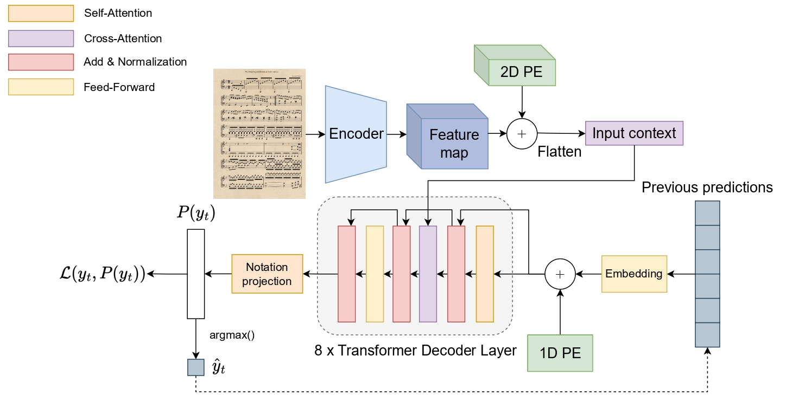

<p align='center'>
  <a href='https://praig.ua.es/'></a>
  <a href='https://www.litislab.fr/'></a>
</p>

<h1 align='center'>End-to-End Full-Page Optical Music Recognition for Pianoform Sheet Music</h1>

<p align = "center">
	<a href="https://arxiv.org/abs/2405.12105"></a>
  </p>

<p align='center'>
  
  
  
  
</p>

<p align="center">
  <a href="https://huggingface.co/collections/antoniorv6/sheet-music-transformer-66b9c7cd447411b9c0acdce0"></a>
  <a href="https://huggingface.co/collections/antoniorv6/smt-datasets-66defa88d50145aa1a518822"></a>
</p>

<p align='center'>
  <a href='#about'>About</a> •
  <a href='#how-to-use'>How To Use</a> •
  <a href='#citations'>Citations</a> •
  <a href='#license'>License</a>
</p>

## About

This GitHub repository contains the implementation of the upgraded version of the Sheet Music Transformer model for full-page pianoform music sheet transcription. Unlike traditional approaches that primarily resort this challenge by implementing layout analysis techniques with end-to-end transcription, this SMT model offers a **complete end-to-end system** for transcribing these scores directly from images. To do so, this model is trained through a progressive curriculum learning strategy with synthetic generation.

<p align="center">
  
</p>

> [!WARNING]
This is a work-in-progress project. Although it is very advanced and has an associate preprint, some bugs may be found.

# Project setup
This implementation has been developed in Python 3.9, PyTorch 2.0 and CUDA 12.0. 

It should work in earlier versions.

To setup a project, run the following configuration instructions:

### Python virtual environment

Create a virtual environment using either virtualenv or conda and run the following:

```sh
git clone https://github.com/antoniorv6/SMT.git
pip install -r requirements.txt
mkdir Data
```

### Docker
If you are using Docker to run experiments, create an image with the provided Dockerfile:

```sh
docker build -t <your_tag> .
docker run -itd --rm --gpus all --shm-size=8gb -v <repository_path>:/workspace/ <image_tag>
docker exec -it <docker_container_id> /bin/bash
```
# Hey, I just want to use the SMT!
Using the SMT for transcribing scores is very easy, thanks to the HuggingFace Transformers 🤗 library. Just implement the following code and you will have the SMT up and running for transcribing excerpts!
```python
import torch
import cv2
from data_augmentation.data_augmentation import convert_img_to_tensor
from smt_model import SMTModelForCausalLM

image = cv2.imread("sample.jpg")
device = "cuda" if torch.cuda.is_available() else "cpu"
model = SMTModelForCausalLM.from_pretrained("antoniorv6/<smt-weights>").to(device)

predictions, _ = model.predict(convert_img_to_tensor(image).unsqueeze(0).to(device), 
                               convert_to_str=True)

print("".join(predictions).replace('<b>', '\n').replace('<s>', ' ').replace('<t>', '\t'))

```

# Data
> [!IMPORTANT]
Access to the datasets should be formally requested through the Huggingface form interface. Please, 

Two of the three datasets datasets created to evaluate the SMT are [publicly available](https://huggingface.co/collections/antoniorv6/smt-datasets-66defa88d50145aa1a518822) for replication purposes.

Eveything is implemented through the HuggingFace Datasets 🤗 library, so loading any of these datasets can be done through just one line of code:

```python
import datasets

dataset = datasets.load_dataset('antoniorv6/<dataset-name>')
```

The dataset has two columns: `image` which contains the original image of the music excerpt for input, and the `transcription`, which contains the corresponding `bekern` notation ground-truth that represents the content of this input. 

## Citations

```bibtex
@misc{RiosVila:2024:SMTplusplus,
      title={End-to-End Full-Page Optical Music Recognition for Pianoform Sheet Music}, 
      author={Antonio Ríos-Vila and Jorge Calvo-Zaragoza and David Rizo and Thierry Paquet},
      year={2024},
      eprint={2405.12105},
      archivePrefix={arXiv},
      primaryClass={cs.CV}
}
```
